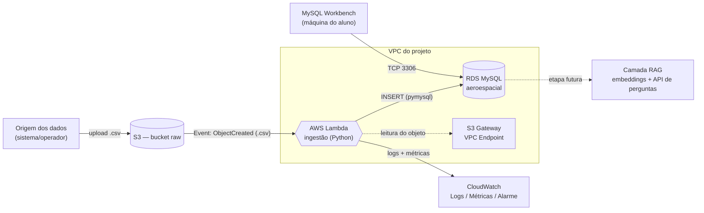

# Solução de Ingestão Automatizada na Nuvem — Telemetria Aeroespacial

**Matéria:** Plataformas, Serviços Cognitivos & Cloud Computing
**Tema:** API na nuvem com RAG
**Foco desta entrega:** pipeline de ingestão automatizada `S3 → Lambda → RDS (MySQL)`, com evidência da automação (CloudWatch) e exploração dos dados (MySQL Workbench conectado ao RDS). A base é modelada já preparada para alimentar um RAG numa etapa posterior.

---

## 1. Objetivo

Planejar e implementar uma solução **serverless e automatizada** que:

1. Recebe arquivos de **telemetria aeroespacial** (leituras de sensores de missão/voo) em um **bucket S3**.
2. **Automaticamente** — sem intervenção manual — processa cada arquivo que chega e grava os dados em uma **base relacional (RDS MySQL)**.
3. **Evidencia a automação** por meio do **CloudWatch** (logs, métricas e alarme) e de uma tabela de auditoria (`ingestao_log`).
4. Permite a **exploração dos dados** via **MySQL Workbench** conectado ao RDS.
5. Deixa o modelo de dados **pronto para RAG** (coluna de texto, metadados em JSON e tabela de embeddings).

## 2. Requisitos da atividade × como são atendidos

| Requisito da atividade | Como é atendido nesta solução |
|---|---|
| Armazenar dados na nuvem de forma automatizada | Bucket S3 + RDS MySQL, sem etapas manuais |
| Ingestão em bucket S3 | Bucket `raw` recebe os arquivos `.csv` |
| Ingestão automática para base relacional | **Event Notification do S3** dispara a **Lambda**, que insere no RDS |
| Serviço serverless | **AWS Lambda** (Python) faz toda a ingestão |
| Evidenciar a automação | **CloudWatch Logs + Métricas customizadas + Alarme** e tabela `ingestao_log` |
| Exploração dos dados | **MySQL Workbench** conectado ao endpoint público do RDS |

## 3. Arquitetura da solução



### Componentes

| Serviço | Papel | Observações |
|---|---|---|
| **Amazon S3** | Zona de aterrissagem (landing zone) dos arquivos brutos | Bucket `raw`, versionado; notificação de evento `s3:ObjectCreated:*` com sufixo `.csv` |
| **AWS Lambda** | Processamento serverless da ingestão | Runtime Python 3.12; valida cada linha, resolve a missão, faz INSERT em lote **idempotente** no RDS, registra log e publica métricas. Conexão reutilizada entre invocações quentes |
| **Amazon RDS (MySQL 8)** | Base relacional de destino | Multi-subnet; `publicly_accessible` para o Workbench; acesso restrito por Security Group |
| **Amazon CloudWatch** | Observabilidade e evidência da automação | Log group da Lambda + métricas EMF (`GSCloud/Ingestao`) + alarme de erro + **dashboard** (evidência em 1 print) |
| **Amazon SQS (DLQ)** | Tolerância a falhas | Fila *dead-letter*: captura o evento se a Lambda falhar após as tentativas, evitando perda silenciosa do arquivo |
| **VPC + S3 Gateway Endpoint** | Rede privada e acesso ao S3 sem NAT | Lambda na VPC fala com o RDS por IP privado; lê o S3 pelo endpoint (custo zero, sem NAT Gateway) |
| **IAM** | Permissões mínimas | Role da Lambda: logs (VPC access), `s3:GetObject` no bucket, `sqs:SendMessage` na DLQ |

## 4. Fluxo da ingestão automatizada (jornada do dado)

1. Um arquivo `telemetria_*.csv` é enviado para o bucket S3 (`s3://<bucket>/incoming/...`).
2. O S3 emite um evento `ObjectCreated` e **invoca a Lambda** automaticamente.
3. A Lambda:
   - baixa o objeto e lê com `csv.DictReader`;
   - para cada `codigo_missao` distinto, faz **upsert** na tabela `missao` (cria se não existir) e guarda o `id_missao`;
   - converte e valida cada linha e acumula em lotes;
   - executa `INSERT` em lote (`executemany`) na tabela `telemetria`;
   - grava um registro em `ingestao_log` (arquivo, linhas lidas/inseridas, erros, status, duração);
   - publica métricas no CloudWatch (`LinhasInseridas`, `LinhasComErro`, `ArquivosProcessados`, `DuracaoMs`).
4. O **CloudWatch** retém os logs estruturados e as métricas; um **alarme** dispara se `LinhasComErro > 0`.
5. O aluno abre o **MySQL Workbench**, conecta no RDS e roda consultas de exploração.

## 5. Modelagem de dados

Quatro tabelas (DDL completo em [`sql/schema.sql`](../sql/schema.sql)):

- **`missao`** — cabeçalho da missão/voo (`codigo_missao` único, `descricao TEXT`). O campo `descricao` já é "combustível" para o RAG.
- **`telemetria`** — leituras de sensor de alta volumetria, **alvo da ingestão do CSV**. Medições em `DECIMAL` (precisão exata, sem perda de casas) e `timestamp_leitura DATETIME(6)` (microssegundos). Chave única `(id_missao, timestamp_leitura)` → **ingestão idempotente**: reenviar o mesmo arquivo (`INSERT IGNORE`) não duplica linhas.
- **`ingestao_log`** — auditoria de cada execução da Lambda. **Esta tabela é evidência direta da automação** (mostra arquivo, contagem e horário de cada ingestão).
- **`documento_rag`** — preparação para RAG: `conteudo TEXT`, `metadados JSON` e `embedding JSON` (placeholder do vetor).

Relacionamentos: `telemetria.id_missao → missao` e `documento_rag.id_missao → missao` (chaves estrangeiras, InnoDB).

### Por que a precisão fica no schema, não no arquivo
A telemetria exige precisão numérica. Em vez de depender do formato do arquivo, ela é garantida pelos **tipos `DECIMAL`** (ex.: `altitude_m DECIMAL(10,3)`): o CSV transporta o texto e o MySQL converte para decimal exato no INSERT, sem o arredondamento típico de `FLOAT`/`DOUBLE`.

## 6. Decisão de formato: CSV agora, Parquet como evolução

| Critério | CSV (escolhido) | Parquet (evolução documentada) |
|---|---|---|
| Simplicidade na Lambda | `csv` é stdlib → **sem layer**, cold start menor | exige `pyarrow`/`pandas` em layer (50–200 MB) |
| Facilidade de evidência | abre em qualquer editor e no Workbench | binário, difícil de printar |
| Tamanho/IO | maior | **colunar + compressão (~70–80% menor)** |
| Leitura seletiva | lê tudo | **predicate pushdown** (lê só colunas/linhas necessárias) |
| Precisão | garantida no schema (`DECIMAL`) | tipos nativos preservados no arquivo |

**Decisão:** usar **CSV** na ingestão por ser o mais didático, barato e fácil de evidenciar para esta entrega, mantendo a precisão no schema. O documento registra a **migração para Parquet** como otimização de escala/produção (caminho: gerar Parquet na origem → ler com `pyarrow` numa layer da Lambda, ou processar com **AWS Glue** quando o volume crescer).

## 7. Segurança e rede

- **RDS** em sub-redes da VPC, com `publicly_accessible = true` **apenas** para permitir o acesso do MySQL Workbench. O **Security Group** libera a porta 3306 somente para (a) o IP do aluno e (b) o Security Group da Lambda.
- **Lambda** na mesma VPC; alcança o RDS por **IP privado** e lê o S3 por um **Gateway VPC Endpoint** (sem NAT, custo zero).
- **Credenciais do banco:** nesta entrega vão como variáveis de ambiente da Lambda (didático). Como a Lambda está em VPC **sem NAT**, usar o **Secrets Manager** exigiria um *interface VPC endpoint* (pago) — por isso a escolha consciente por env vars no escopo do trabalho. **Em produção:** adicionar o endpoint do Secrets Manager e ler a senha (com rotação) em tempo de execução.
- **Tolerância a falhas:** falhas inesperadas re-lançam a exceção → o S3 reentrega (assíncrono) e, esgotadas as tentativas, o evento cai na **DLQ (SQS)**. Erros de *dados* (linha inválida) não derrubam o arquivo: viram status `PARCIAL` com a contagem em `ingestao_log`.
- **IAM** com permissão mínima (logs/ENI na VPC + `s3:GetObject` no bucket). As métricas saem por EMF, então não é preciso `cloudwatch:PutMetricData`.

## 8. Automação e evidências (CloudWatch)

A automação é comprovada por fontes complementares:

1. **CloudWatch Logs** — cada execução escreve linhas estruturadas (JSON) com `request_id`, arquivo, linhas inseridas e duração.
2. **CloudWatch Métricas (via EMF)** — namespace `GSCloud/Ingestao`: `ArquivosProcessados`, `LinhasInseridas`, `LinhasComErro`, `DuracaoMs`. As métricas são emitidas em **Embedded Metric Format**: a Lambda imprime uma linha JSON e o CloudWatch extrai as métricas sozinho — sem chamada de API, o que é essencial porque a Lambda roda na VPC **sem NAT**.
3. **Dashboard** — painel `gs-cloud-ingestao` reúne linhas/arquivos, duração e invocações/erros da Lambda: a evidência da automação em **um único print**.
4. **Alarme** — dispara quando `LinhasComErro > 0` em qualquer janela, evidenciando o tratamento de falhas.
5. **Tabela `ingestao_log`** — trilha de auditoria no próprio banco, consultável no Workbench.
6. **DLQ (SQS)** — se um arquivo falhar de forma irrecuperável, o evento aparece na fila, provando que nada é perdido silenciosamente.

O roteiro [`docs/02-roteiro-execucao.md`](02-roteiro-execucao.md) lista exatamente quais prints coletar.

## 9. Exploração dos dados (MySQL Workbench → RDS)

Após a ingestão, o aluno conecta o Workbench ao endpoint do RDS e roda consultas como:

```sql
-- Volume ingerido por missão
SELECT m.codigo_missao, COUNT(*) AS leituras,
       MIN(t.timestamp_leitura) AS inicio, MAX(t.timestamp_leitura) AS fim
FROM telemetria t JOIN missao m ON m.id_missao = t.id_missao
GROUP BY m.codigo_missao;

-- Trilha de automação (evidência)
SELECT nome_arquivo, qtd_linhas_inseridas, qtd_erros, status, finalizado_em
FROM ingestao_log ORDER BY finalizado_em DESC;

-- Picos de telemetria (ex.: altitude máxima por missão)
SELECT m.codigo_missao, MAX(t.altitude_m) AS altitude_max_m,
       AVG(t.velocidade_ms) AS vel_media_ms
FROM telemetria t JOIN missao m ON m.id_missao = t.id_missao
GROUP BY m.codigo_missao;
```

## 10. Custos / Free Tier

Todos os serviços têm camada gratuita compatível com o projeto:
- **S3**: 5 GB.
- **Lambda**: 1 M de requisições/mês.
- **RDS**: 750 h/mês de `db.t3.micro` + 20 GB (12 meses).
- **CloudWatch**: 10 métricas customizadas + 5 GB de logs.
- **VPC/Gateway Endpoint do S3**: sem custo.

> **Atenção:** desligue/derrube os recursos após coletar as evidências (`terraform destroy` ou remoção manual) para não gerar cobrança fora do Free Tier.

## 11. Evolução para RAG (próxima etapa)

A base já nasce preparada:
1. Popular `documento_rag.conteudo` com textos derivados (resumos de missão, notas de anomalia, descrições de eventos).
2. Gerar **embeddings** desses textos (ex.: modelo de embeddings via Amazon Bedrock) e guardar em `documento_rag.embedding`.
3. Indexar/consultar por similaridade (MySQL 9 `VECTOR`, ou migrar a camada vetorial para **pgvector**/**OpenSearch**).
4. Expor uma **API serverless** (API Gateway + Lambda) que recebe a pergunta, recupera os trechos mais similares e monta o prompt do LLM (RAG).

## 12. Estrutura do repositório

```
GS-Cloud/
├── docs/
│   ├── 01-design.md            ← este documento (planejamento/arquitetura)
│   └── 02-roteiro-execucao.md  ← passo a passo + coleta de evidências
├── sql/
│   └── schema.sql              ← DDL do RDS (tabelas + consultas de exploração)
├── lambda/
│   └── ingest/
│       ├── handler.py          ← função Lambda de ingestão
│       └── requirements.txt    ← pymysql
├── infra/terraform/            ← IaC (VPC, S3, RDS, Lambda, IAM, CloudWatch)
├── data/
│   ├── telemetria_exemplo.csv     ← arquivo de teste (caminho feliz)
│   └── telemetria_com_erros.csv   ← arquivo com 1 linha inválida (testa PARCIAL)
├── build.ps1 / build.sh        ← empacota a Lambda (handler + pymysql)
└── README.md
```
