# Relatório — Ingestão Automatizada na Nuvem (Telemetria Aeroespacial)

**Matéria:** Plataformas, Serviços Cognitivos & Cloud Computing
**Tema:** API na nuvem com RAG
**Alunos:**
- Guilherme Orugian — RM 572882
- Rodrigo Bettio — RM 573725
- Rafael Jun — RM 569708

**Data:** 09/06/2026
**Repositório:** https://github.com/orugian/gs-cloud

---

## 1. Objetivo

Planejar e implementar uma solução **serverless e automatizada** que recebe arquivos de **telemetria aeroespacial** em um **bucket S3** e, sem nenhuma intervenção manual, processa e grava os dados em uma **base relacional RDS MySQL**. A automação é evidenciada pelo **Amazon CloudWatch** (logs e métricas) e os dados são explorados via **DBeaver** conectado ao endpoint do RDS. O modelo de dados já é construído de forma a suportar uma camada de **RAG** em etapa futura.

## 2. Arquitetura

```
upload .csv ─► S3 (bucket) ─►(evento ObjectCreated)─► Lambda (Python 3.12) ─► RDS MySQL 8
                                        │                                           │
                                 CloudWatch                                   DBeaver
                              (logs + métricas EMF)                     (exploração dos dados)
```

O evento `ObjectCreated` do S3 invoca a Lambda automaticamente. A função valida cada linha, resolve a missão via upsert, insere a telemetria em lote com `INSERT IGNORE` (idempotente) e registra a execução em `ingestao_log`. As métricas são emitidas em **Embedded Metric Format (EMF)** — a Lambda imprime JSON estruturado no stdout e o CloudWatch extrai as métricas automaticamente, sem chamada de API.

## 3. Serviços AWS utilizados

| Serviço | Papel |
|---|---|
| Amazon S3 | Zona de aterrissagem (landing zone) dos arquivos `.csv` |
| AWS Lambda (Python 3.12) | Ingestão serverless: valida, processa e grava no RDS |
| Amazon RDS (MySQL 8) | Base relacional de destino com 4 tabelas normalizadas |
| Amazon CloudWatch | Logs estruturados + métricas customizadas (EMF) — evidência da automação |
| IAM (LabRole) | Permissões de execução da função Lambda |

## 4. Execução e evidências

**4.1 RDS provisionado**
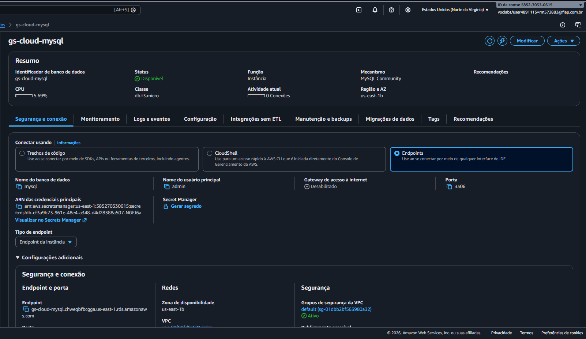

**4.2 Bucket S3**
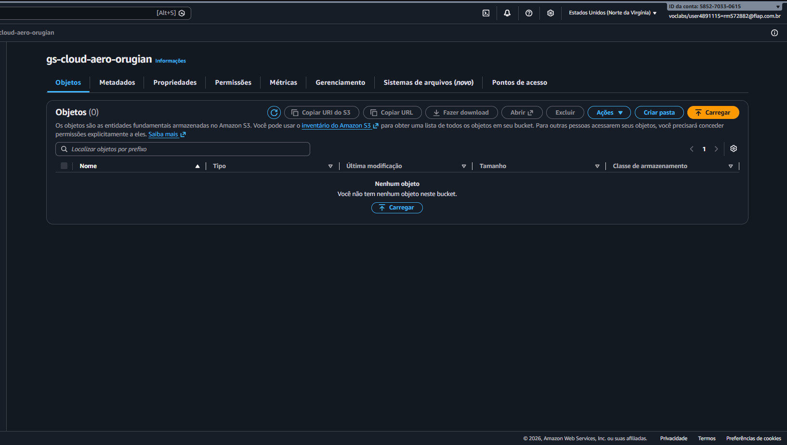

**4.3 Conexão ao banco e criação do schema**
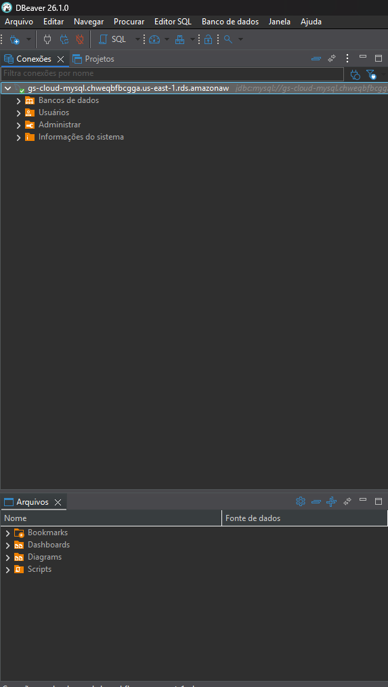
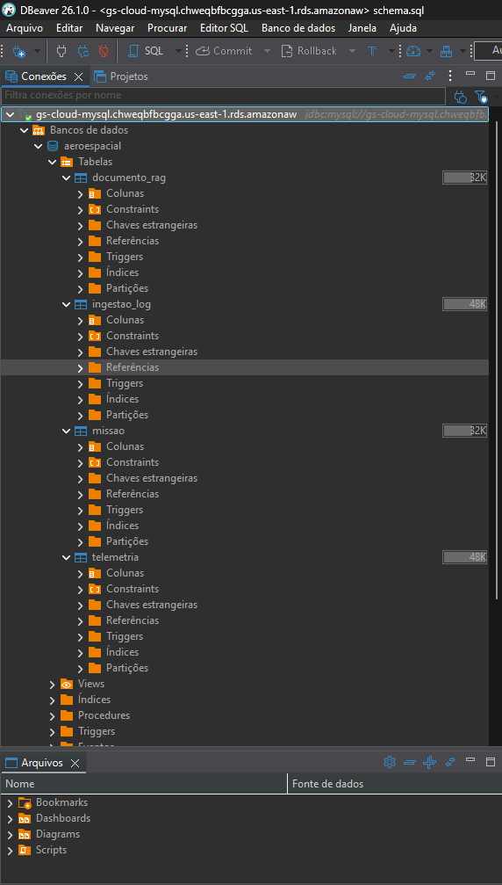

**4.4 Função Lambda**
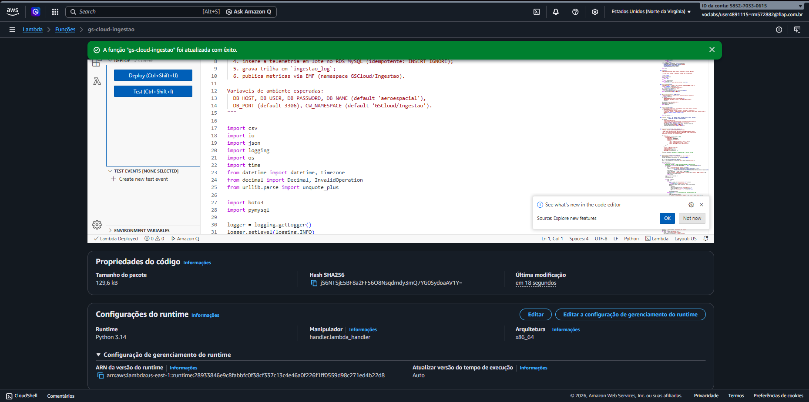
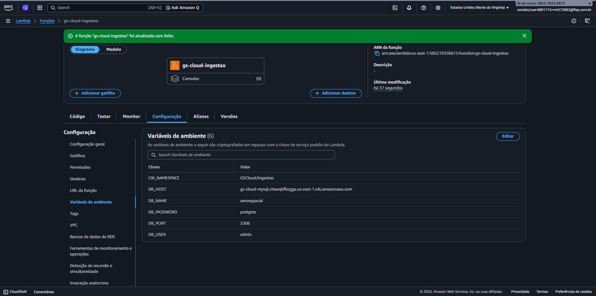

**4.5 Gatilho automático (S3 → Lambda)**
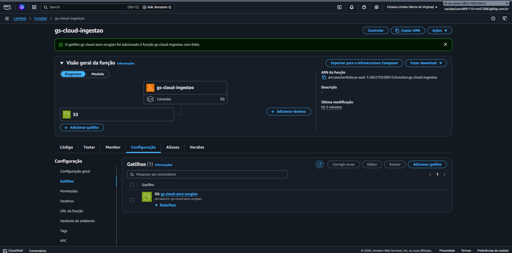

**4.6 Ingestão disparada pelo upload**
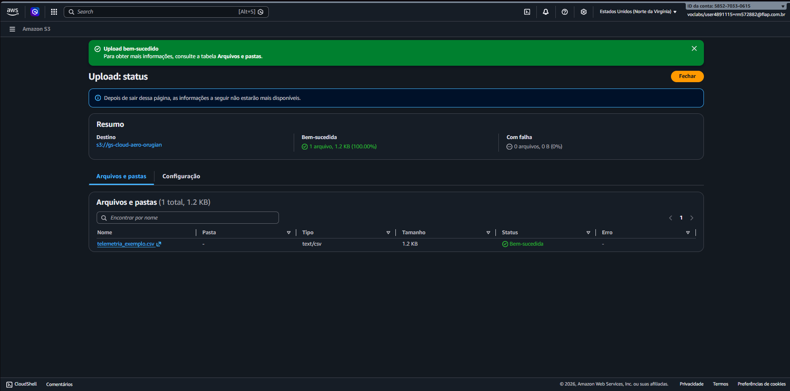

## 5. Automação evidenciada (CloudWatch)

O upload do arquivo `.csv` no bucket S3 dispara a Lambda **sem nenhuma ação manual**. O CloudWatch registra toda a execução:

**5.1 Logs da execução automática**
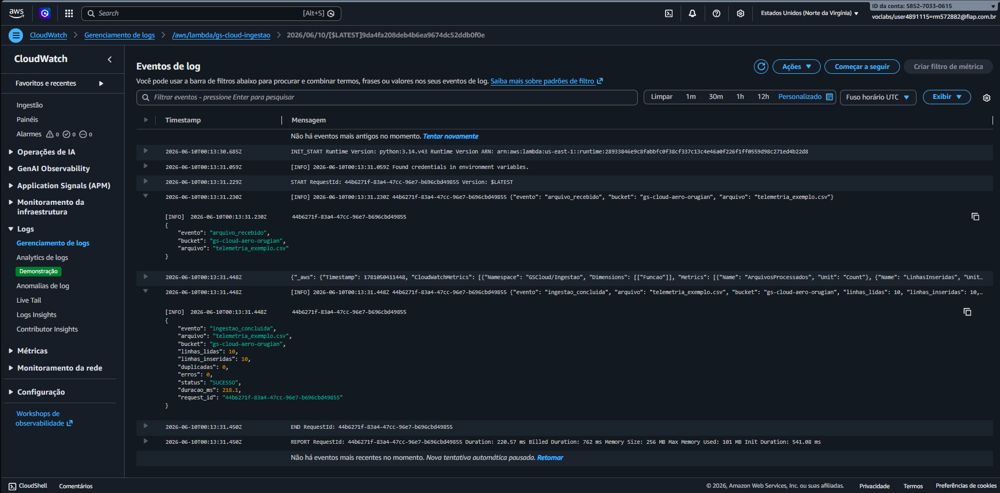

**5.2 Métricas da ingestão (namespace `GSCloud/Ingestao`)**
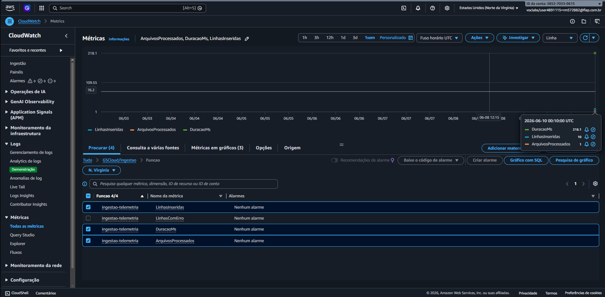

> As métricas `LinhasInseridas`, `ArquivosProcessados` e `DuracaoMs` são publicadas via **Embedded Metric Format**: a Lambda escreve JSON no stdout e o CloudWatch extrai as métricas automaticamente — sem chamada de API e sem necessidade de permissão `cloudwatch:PutMetricData`.

## 6. Exploração dos dados (DBeaver → RDS)

Após a ingestão, o DBeaver é conectado ao endpoint público do RDS para consultar e explorar os dados inseridos automaticamente.

**6.1 Trilha de auditoria da ingestão**
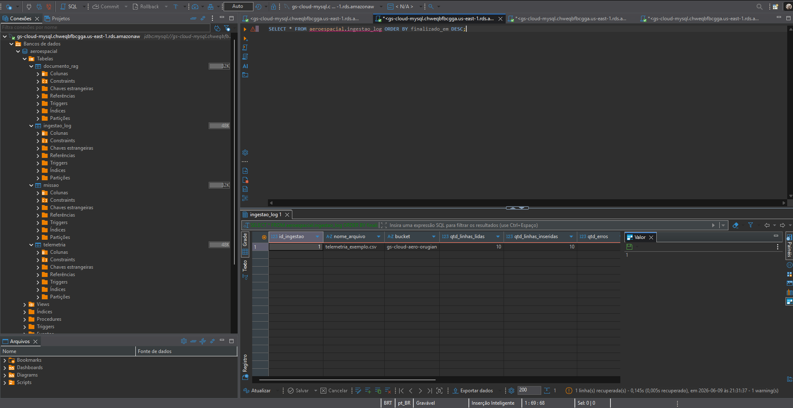

**6.2 Volume ingerido por missão**
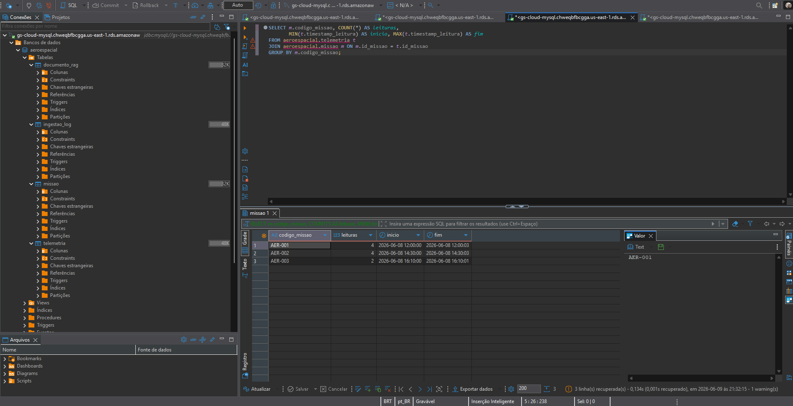

**6.3 Análise (picos e médias por missão)**
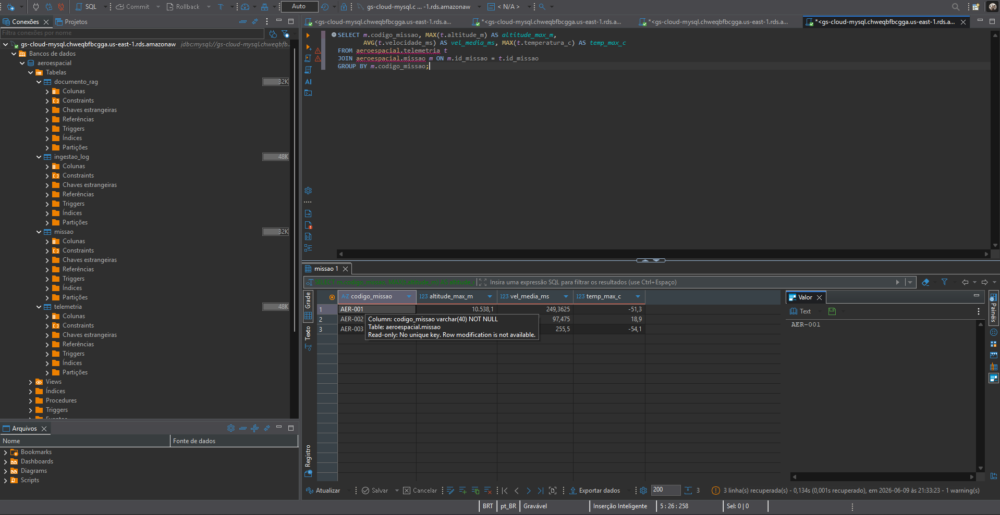

## 7. Robustez da solução

**7.1 Tratamento de erro — status PARCIAL**

Quando um arquivo contém linhas com dados inválidos (ex.: `SENSOR_FALHOU` em campo numérico), a Lambda rejeita apenas as linhas problemáticas e prossegue com as demais. O resultado aparece em `ingestao_log` com `status = PARCIAL` e a contagem de erros, sem interromper a ingestão.

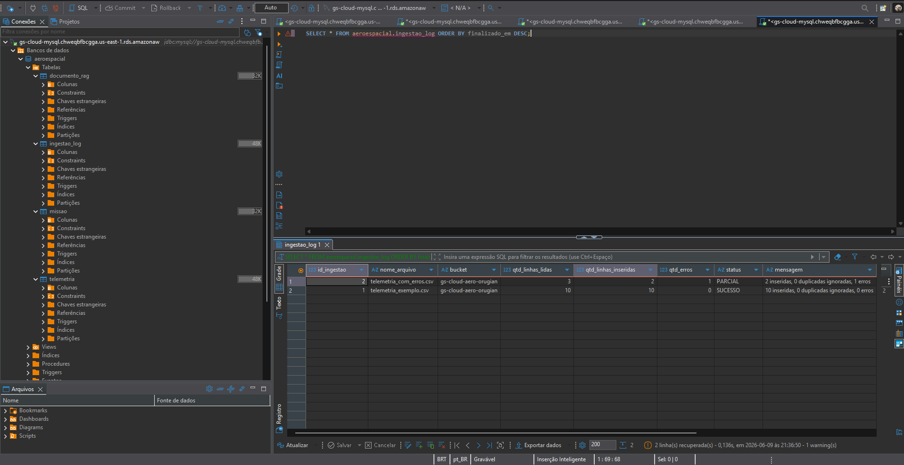

**7.2 Idempotência — reprocessamento sem duplicação**

O reenvio do mesmo arquivo não gera duplicatas. A chave única `(id_missao, timestamp_leitura)` combinada com `INSERT IGNORE` garante que linhas já existentes sejam ignoradas. O `ingestao_log` registra `qtd_linhas_inseridas = 0` no reprocessamento, provando a idempotência.

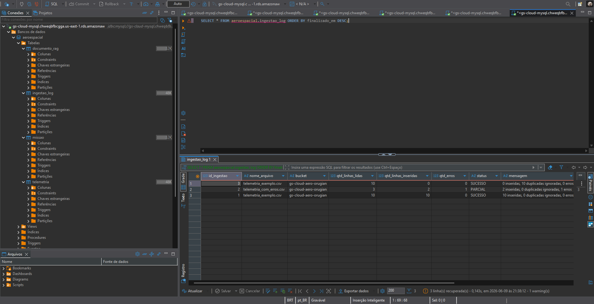

## 8. Conclusão

O projeto demonstrou uma solução completa de ingestão automatizada na nuvem para dados de telemetria aeroespacial. O upload de um arquivo `.csv` no bucket S3 dispara automaticamente a função Lambda, que valida, processa e persiste os dados no RDS MySQL — sem nenhuma intervenção manual. A automação foi comprovada pelos logs estruturados e pelas métricas customizadas do CloudWatch (`GSCloud/Ingestao`). A exploração dos dados via DBeaver confirmou a integridade e completude das inserções realizadas. A solução ainda demonstrou robustez no tratamento de erros de dados (status `PARCIAL`) e confiabilidade por idempotência (`INSERT IGNORE`). O modelo de dados — com a tabela `documento_rag` contendo campos de `conteudo`, `metadados` e `embedding` — está preparado para a implementação de uma camada de RAG em etapa futura.

## 9. Preparação para RAG (trabalho futuro)

A modelagem já contempla `missao.descricao` (texto livre sobre a missão) e a tabela `documento_rag` (conteúdo + metadados JSON + embedding JSON), permitindo, numa próxima etapa:

1. Popular `documento_rag.conteudo` com resumos de missão, notas de anomalia e descrições de eventos derivados da telemetria.
2. Gerar **embeddings** via Amazon Bedrock e armazená-los em `documento_rag.embedding`.
3. Expor uma **API serverless** (API Gateway + Lambda) que recebe perguntas em linguagem natural, recupera os trechos mais similares por similaridade vetorial e monta o prompt do LLM — pipeline completo de RAG sobre os dados ingeridos.
